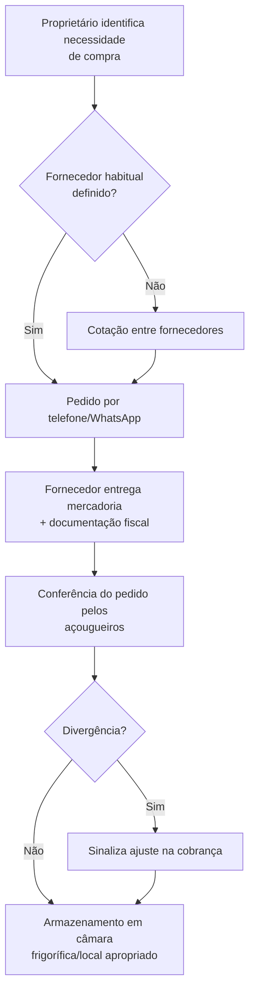
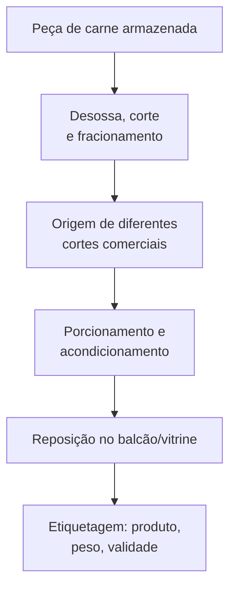
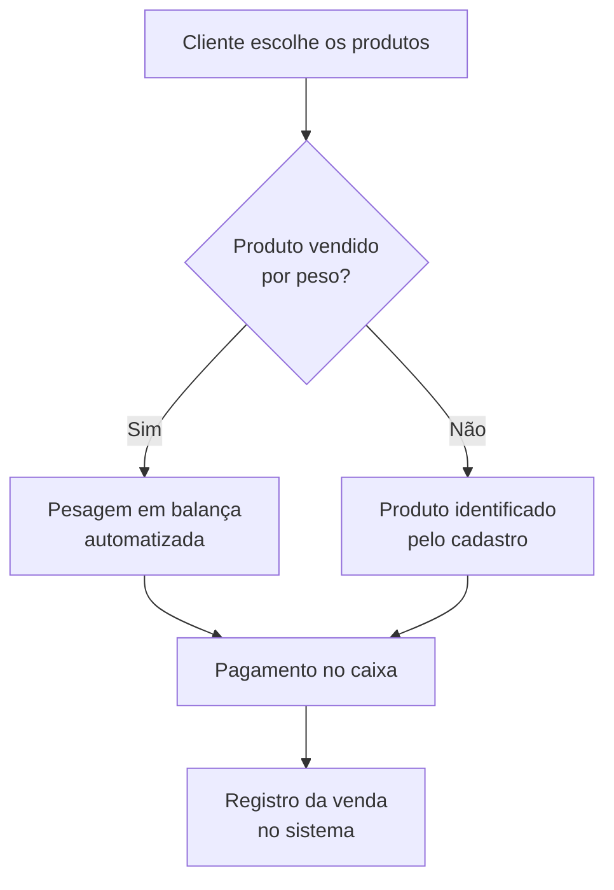
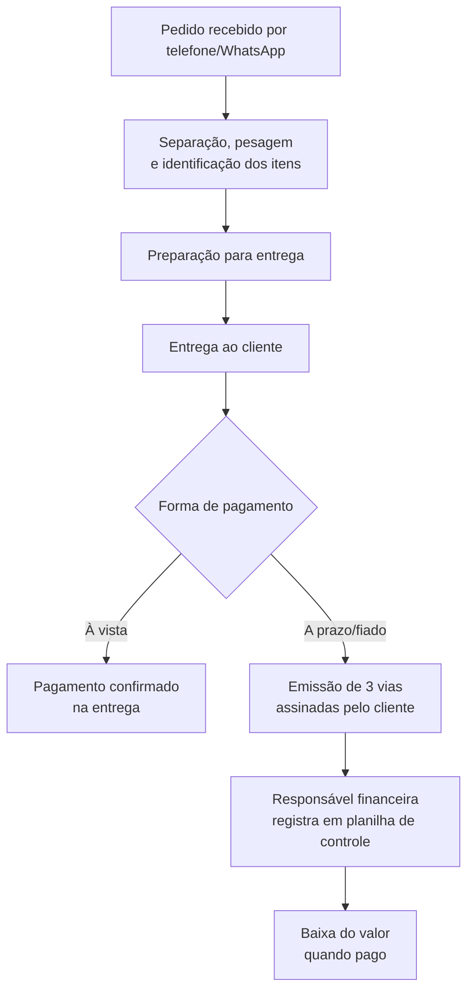

# Entrega 1 — Modelo Conceitual (DER)
### Modelagem de um sistema de gestão de informações para uma organização de pequeno porte

# Grupo da apresentação:
### - Gabriel Diniz Tavares da Costa - RGM 48222721
### - Isaac Santos Alves da Costa - RGM 48222852
### - Rafael Aceiro Ferreira Gomes - RGM 1748225223
### - Paulo Henrique Fernandez Prado - RGM  48100650

> **Organização:** Açougue *[PREENCHER: nome fantasia do estabelecimento]*
> O DER é anexado separadamente a este repositório (em imagem).

---

## 1. Caracterização da Organização

- **Nome e natureza da organização:** *[PREENCHER: nome do açougue]*, comércio varejista de carnes, produtos congelados e mercearia, com fins lucrativos, único estabelecimento (sem filiais).
- **Contexto e porte:** Estabelecimento em funcionamento há mais de 15 anos, formalizado e com CNPJ ativo. A operação conta com 12 pessoas: 1 proprietário, 5 açougueiros, 2 balconistas, 2 operadores de caixa, 1 ajudante geral, 1 entregador e 1 responsável administrativo-financeiro. Funciona de segunda a sábado das 7h30 às 20h, e aos domingos e feriados das 7h30 às 14h, com um volume médio de 300 a 400 vendas por dia — o que caracteriza uma operação de médio porte para os padrões do setor.
- **Problemas e necessidades identificados:** O estabelecimento já utiliza um sistema de gestão para cadastro de produtos, preços e registro de vendas no caixa, mas diversos controles importantes ainda são feitos de forma manual/visual e ficam fora do sistema:
  - Não há cadastro de fornecedores no sistema (contatos ficam na agenda pessoal do proprietário), embora a função exista.
  - Não há controle de estoque automatizado: entradas de mercadorias não geram movimentação de estoque, e o saldo de cada produto só é conhecido por contagem física.
  - Não existe estoque mínimo parametrizado — a reposição depende da experiência dos responsáveis.
  - As perdas de peso decorrentes de desossa e corte (ossos, gordura, aparas) não são quantificadas no sistema.
  - As vendas a prazo/fiado são controladas por planilha e vias de pedido assinadas, fora do sistema, gerando trabalho manual de conciliação pela responsável financeira.
  - Não há rastreabilidade centralizada de lote/validade — as informações ficam dispersas em etiquetas e embalagens.
- **Justificativa da escolha:** O açougue é uma organização real, de porte adequado ao trabalho (nem tão simples a ponto de faltar processos, nem grande/complexa a ponto de ser inviável nesta etapa), com processos de negócio ricos e específicos do setor (compra e desossa de carne, controle de validade, venda por peso, venda a prazo/fiado, delivery) que geram entidades e regras de negócio suficientes para uma modelagem conceitual completa. Além disso, o grupo teve acesso direto ao proprietário para o levantamento de requisitos em campo.
- **Evidências da organização:** *[PREENCHER: link do Google Maps/Google Meu Negócio ou rede social do açougue, endereço completo, telefone/WhatsApp de contato, e fotos da visita/entrevista]*

---

## 2. Processos de Negócio

### 2.1 Principais processos mapeados

1. **Compra e recebimento de mercadorias junto a fornecedores** (inclui cotação, pedido, recebimento e conferência fiscal).
2. **Preparação e disponibilização das carnes para venda** (desossa, corte, porcionamento, embalagem, etiquetagem).
3. **Controle de estoque e validade** (verificação física periódica, identificação de necessidade de reposição).
4. **Venda no balcão** (pesagem, identificação, pagamento).
5. **Venda por telefone/WhatsApp e delivery/encomenda**.
6. **Venda a prazo (boleto ou "fiado")** e controle dos valores devidos por cliente.
7. **Descarte de resíduos** da manipulação das carnes.

### 2.2 Fluxogramas

**Processo de compra e recebimento**

**Preparação da carne e disposição para venda**

**Venda no balcão**

**Venda por delivery/encomenda e venda a prazo**

---

## 3. Requisitos do Sistema

### 3.1 Requisitos Funcionais

- O sistema deve permitir cadastrar produtos com nome, tipo/categoria e preço.
- O sistema deve permitir registrar vendas por peso (integração com balança) e por unidade.
- O sistema deve permitir registrar vendas realizadas no balcão, por telefone/WhatsApp e delivery.
- O sistema deve permitir emitir etiquetas com identificação do produto, peso e validade.
- O sistema deve permitir registrar encomendas/pedidos futuros quando o produto não está disponível.
- O sistema deve permitir cadastrar fornecedores e associá-los aos pedidos de compra realizados.
- O sistema deve permitir registrar pedidos de compra a fornecedores (produto, quantidade, prazo de entrega, valor).
- O sistema deve permitir registrar a movimentação de entrada de mercadorias e atualizar o saldo de estoque.
- O sistema deve permitir consultar o saldo de estoque atual de cada produto.
- O sistema deve permitir definir um estoque mínimo por produto e alertar quando o saldo estiver abaixo dele.
- O sistema deve permitir registrar o controle de validade dos produtos armazenados.
- O sistema deve permitir registrar clientes (nome/razão social, CPF/CNPJ, telefone, endereço) quando necessário para emissão fiscal, boleto ou venda a prazo.
- O sistema deve permitir registrar vendas a prazo (boleto ou fiado), associando cliente, valor e prazo de pagamento.
- O sistema deve permitir controlar a baixa (pagamento) das vendas a prazo por cliente.
- O sistema deve permitir registrar diferentes formas de pagamento (dinheiro, Pix, cartão de crédito/débito, vale-alimentação/refeição, boleto, fiado).
- O sistema deve permitir registrar funcionários e a função exercida por cada um.
- O sistema deve permitir registrar descontos concedidos, associados à autorização do proprietário.

### 3.2 Requisitos Não Funcionais

- **Usabilidade:** o sistema deve ser simples o suficiente para uso por balconistas e operadores de caixa durante o atendimento, sem atrasar a fila.
- **Desempenho:** o registro de uma venda (incluindo pesagem) deve ser processado em poucos segundos, dado o alto volume diário (300–400 vendas/dia).
- **Confiabilidade:** o sistema deve manter a integridade dos dados de estoque e financeiro mesmo diante de falhas, evitando divergências entre estoque físico e sistêmico.
- **Segurança:** o acesso a informações financeiras e a dados de clientes (CPF/CNPJ, endereço) deve ser restrito a perfis autorizados (proprietário e responsável administrativo-financeira).
- **Disponibilidade:** o sistema deve estar disponível durante todo o horário de funcionamento do estabelecimento (7h30–20h em dias úteis e sábados; 7h30–14h aos domingos/feriados).
- **Escalabilidade:** o modelo de dados deve comportar a inclusão futura de controle automatizado de estoque e rastreabilidade de lote, hoje realizados manualmente.

---

## 4. Regras de Negócio

### Regras operacionais

- Uma venda por peso só pode ser registrada após a pesagem do produto na balança automatizada.
- Uma venda a prazo só pode ser realizada para clientes previamente autorizados pelo proprietário.
- Descontos só podem ser concedidos mediante autorização do proprietário; não há regra automática de desconto.
- Uma encomenda pode ser registrada mesmo quando o produto não está disponível no estoque no momento da solicitação.
- O prazo de pagamento de vendas via boleto é de 15 dias; demais vendas a prazo (fiado) autorizadas têm prazo de até 30 dias.
- A cada venda a prazo/fiado são emitidas 3 vias do pedido, assinadas pelo cliente no momento da entrega ou retirada.
- Peças de carne recebidas em maior porte devem passar por desossa/corte antes de serem disponibilizadas como cortes comerciais para venda.
- Resíduos da manipulação de carnes (ossos, gordura, pele) devem ser separados e acondicionados para coleta diária por empresa especializada.
- A identificação do cliente por CPF só é exigida quando necessária para emissão de documento fiscal, boleto ou faturamento.

### Restrições organizacionais

- **Sanitárias/legais:** produtos perecíveis exigem controle de validade e condições específicas de armazenamento/conservação por categoria (carnes, congelados, mercearia, bebidas), refletindo normas sanitárias aplicáveis ao comércio de alimentos.
- **Fiscais:** vendas exigem emissão de cupom/documento fiscal; vendas com faturamento/boleto exigem dados cadastrais completos do cliente (nome/razão social, CNPJ, telefone, endereço).
- **Operacionais:** a divisão de funções é rígida quanto a atividades de desossa e corte — apenas açougueiros realizam essas tarefas, os balconistas não.
- **Financeiras:** o controle das vendas a prazo é hoje mantido fora do sistema principal (planilha), o que o modelo de dados deve endereçar como oportunidade de melhoria.

---

## 5. Dicionário de Dados Conceitual (Preliminar)

**Atenção:** todos os valores de exemplo abaixo são fictícios, apenas coerentes com a operação observada.

### Entidade: Funcionário

| Atributo | Descrição | Regra de negócio associada |
|----------|-----------|------------------------------|
| id_funcionario | Identificador único do funcionário | Obrigatório, gerado pelo sistema |
| nome | Nome completo | Obrigatório |
| funcao | Função exercida (proprietário, açougueiro, balconista, caixa, ajudante geral, entregador, administrativo/financeiro) | Obrigatório; define permissões de acesso |
| telefone | Telefone de contato | Opcional |

### Entidade: Fornecedor

| Atributo | Descrição | Regra de negócio associada |
|----------|-----------|------------------------------|
| id_fornecedor | Identificador único do fornecedor | Obrigatório |
| nome_razao_social | Nome ou razão social do fornecedor | Obrigatório |
| telefone_whatsapp | Contato usado para realizar pedidos | Obrigatório (pedidos são feitos por telefone/WhatsApp) |
| tipo_produto_fornecido | Categoria principal de produto fornecido (ex.: carne bovina, mercearia) | Auxilia na definição de fornecedor habitual |

### Entidade: Categoria de Produto

| Atributo | Descrição | Regra de negócio associada |
|----------|-----------|------------------------------|
| id_categoria | Identificador único | Obrigatório |
| descricao | Nome da categoria (ex.: carne bovina, suína, ave, congelado, mercearia, massa, bebida, rotisseria) | Obrigatório |
| regra_armazenamento | Condição de conservação exigida pela categoria | Cada categoria tem regra própria de armazenamento/validade |

### Entidade: Produto

| Atributo | Descrição | Regra de negócio associada |
|----------|-----------|------------------------------|
| id_produto | Identificador único | Obrigatório |
| nome | Nome do produto/corte | Obrigatório |
| id_categoria | Categoria do produto | Referencia Categoria de Produto |
| unidade_venda | Forma de comercialização (peso ou unidade) | Define se exige pesagem em balança |
| preco | Preço unitário ou por quilo vigente | Obrigatório; usado pela balança automatizada |
| estoque_minimo | Quantidade mínima desejada em estoque | Opcional (hoje não parametrizado; melhoria proposta) |

### Entidade: Pedido de Compra (a Fornecedor)

| Atributo | Descrição | Regra de negócio associada |
|----------|-----------|------------------------------|
| id_pedido_compra | Identificador único | Obrigatório |
| id_fornecedor | Fornecedor do pedido | Obrigatório |
| data_pedido | Data em que o pedido foi realizado | Obrigatório |
| prazo_entrega | Prazo combinado de entrega | Normalmente entre 1 e 3 dias |
| status | Situação do pedido (pendente, recebido, com divergência) | — |

### Entidade: Item do Pedido de Compra

| Atributo | Descrição | Regra de negócio associada |
|----------|-----------|------------------------------|
| id_item_pedido_compra | Identificador único | Obrigatório |
| id_pedido_compra | Pedido ao qual pertence | Obrigatório |
| id_produto | Produto solicitado | Obrigatório |
| quantidade | Quantidade solicitada | Obrigatório |

### Entidade: Cliente

| Atributo | Descrição | Regra de negócio associada |
|----------|-----------|------------------------------|
| id_cliente | Identificador único | Obrigatório apenas quando há cadastro |
| nome_razao_social | Nome/razão social | Obrigatório para boleto/faturamento |
| cpf_cnpj | Documento fiscal | Exigido para emissão de documento fiscal, boleto ou venda a prazo |
| telefone | Contato | Obrigatório para boleto/faturamento |
| endereco | Endereço de entrega/cobrança | Obrigatório para boleto/faturamento |
| autorizado_prazo | Indica se o cliente está autorizado a comprar a prazo | Só clientes autorizados pelo proprietário |

### Entidade: Venda

| Atributo | Descrição | Regra de negócio associada |
|----------|-----------|------------------------------|
| id_venda | Identificador único | Obrigatório |
| canal | Canal da venda (balcão, telefone/WhatsApp, delivery) | Obrigatório |
| data_hora | Data e hora da venda | Obrigatório |
| id_cliente | Cliente identificado (quando aplicável) | Opcional na maioria das vendas de balcão |
| forma_pagamento | Forma de pagamento utilizada | Dinheiro, Pix, cartão, vale, boleto ou fiado |
| valor_total | Valor total da venda | Calculado a partir dos itens |
| desconto | Valor de desconto concedido | Só com autorização do proprietário |

### Entidade: Item de Venda

| Atributo | Descrição | Regra de negócio associada |
|----------|-----------|------------------------------|
| id_item_venda | Identificador único | Obrigatório |
| id_venda | Venda à qual pertence | Obrigatório |
| id_produto | Produto vendido | Obrigatório |
| peso_quantidade | Peso (kg) ou quantidade vendida | Peso obtido da balança automatizada quando aplicável |
| preco_unitario | Preço no momento da venda | Obrigatório |

### Entidade: Venda a Prazo

| Atributo | Descrição | Regra de negócio associada |
|----------|-----------|------------------------------|
| id_venda_prazo | Identificador único | Obrigatório |
| id_venda | Venda associada | Obrigatório |
| id_cliente | Cliente devedor | Obrigatório; deve estar autorizado |
| modalidade | Boleto ou fiado | Define prazo de pagamento (15 ou 30 dias) |
| data_vencimento | Data limite para pagamento | Calculada a partir da modalidade |
| status_pagamento | Pendente ou pago | Atualizado na baixa do pagamento |

---

## 6. Modelagem Conceitual (Entidades, Atributos, Relacionamentos)

- **Entidades reconhecidas:** Funcionário, Fornecedor, Categoria de Produto, Produto, Pedido de Compra, Item do Pedido de Compra, Cliente, Venda, Item de Venda, Venda a Prazo. Cada uma corresponde a um conceito distinto identificado na entrevista de campo (equipe, cadeia de suprimentos, catálogo de produtos, operação de compra, operação de venda e crédito ao cliente).
- **Atributos e classificações:** detalhados na Seção 5 (Dicionário de Dados).
- **Relacionamentos pertinentes:**
  - Um **Fornecedor** realiza vários **Pedidos de Compra**, e cada Pedido de Compra pertence a um único Fornecedor (1:N).
  - Um **Pedido de Compra** contém vários **Itens do Pedido de Compra**, cada item referenciando um **Produto** (1:N; N:1).
  - Um **Produto** pertence a uma **Categoria de Produto**, e uma Categoria agrupa vários Produtos (1:N).
  - Uma **Venda** é composta por vários **Itens de Venda**, cada um referenciando um **Produto** (1:N; N:1).
  - Um **Cliente** pode realizar várias **Vendas**, mas uma venda de balcão pode não ter cliente identificado (0/1:N — relacionamento opcional).
  - Uma **Venda** pode originar, no máximo, uma **Venda a Prazo** (1:0/1), quando a forma de pagamento é boleto ou fiado.
  - Um **Funcionário** registra ou realiza Vendas e Pedidos de Compra conforme sua função (relacionamento a ser detalhado no DER conforme a granularidade adotada pelo grupo).
- **Restrições e políticas organizacionais aplicadas ao modelo:** a obrigatoriedade de cliente autorizado para Venda a Prazo, a exigência de pesagem para itens vendidos por peso, e a diferenciação de regras de armazenamento por categoria de produto foram incorporadas como restrições no modelo.

---

## 7. Diagrama Entidade-Relacionamento (DER)

*[PREENCHER: anexar aqui a imagem do DER, elaborado a partir das entidades, atributos, relacionamentos e cardinalidades descritos nas Seções 5 e 6]*

---

## 8. Justificativa Técnica

*[PREENCHER PELO GRUPO: com base nas entidades e relacionamentos propostos acima, explicar por que essas entidades/atributos/cardinalidades foram escolhidos e não outras alternativas — por exemplo: por que Venda a Prazo é uma entidade separada de Venda em vez de apenas um atributo; por que Cliente é opcional na Venda; por que Item de Pedido de Compra e Item de Venda são entidades associativas separadas.]*

---

## 9. Uso de Inteligência Artificial

| Item | Registro |
|------|------------------|
| **Ferramenta e etapa** | Claude (Anthropic) foi usado para organizar as respostas do levantamento de campo (entrevista com o proprietário do açougue) na estrutura exigida pelo README da Entrega 1, e para redigir um rascunho inicial das seções de Caracterização, Processos de Negócio, Requisitos, Regras de Negócio, Dicionário de Dados e Modelagem Conceitual. |
| **Motivação** | O grupo já havia realizado a entrevista de campo e precisava transformar as respostas em texto estruturado, seguindo o esqueleto de entrega fornecido pelo professor. |
| **Prompt(s) utilizados** | "Quero que você faça o read.me do nosso projeto com base nas informações que já te foram passadas e no esqueleto da entrega 1", seguido do envio do documento completo de levantamento de informações do estabelecimento. |
| **Resposta recebida** | Um rascunho de README organizado nas seções do esqueleto, com fluxogramas em Mermaid, requisitos funcionais/não funcionais, regras de negócio, dicionário de dados preliminar e proposta de entidades/relacionamentos para o modelo conceitual, todos derivados diretamente das respostas da entrevista. |
| **Fontes consultadas e verificadas** | Nenhuma fonte externa foi usada — o conteúdo foi derivado exclusivamente das respostas fornecidas pelo grupo a partir da entrevista de campo. |
| **Trechos rejeitados ou corrigidos** | *[PREENCHER PELO GRUPO após revisão: indicar o que foi ajustado — por exemplo, nomes de entidades renomeados, atributos removidos/adicionados, cardinalidades revisadas]* |
| **Justificativa da escolha final** | *[PREENCHER PELO GRUPO: por que mantiveram, adaptaram ou rejeitaram partes da proposta]* |
| **Reflexão crítica** | A IA não teve acesso à visita física ao estabelecimento nem a informações não mencionadas na entrevista, de forma que entidades/regras não citadas no levantamento (ex.: rastreabilidade de lote, controle de perdas) foram tratadas apenas como requisitos de melhoria, não como funcionalidades já existentes. O grupo deve validar se a proposta de entidades reflete fielmente a operação observada em campo. |

*Se o grupo utilizou outras ferramentas de IA em outras etapas (pesquisa, revisão ortográfica, apresentação), registrar aqui também.*

---

## Resumo dos Pesos

| Dimensão | Peso total |
|----------|-----------|
| Conceitual (contexto, requisitos/regras, modelagem, justificativa técnica) | 30% |
| Procedimental (requisitos, fluxogramas, dicionário de dados, DER) | 50% |
| Atitudinal (participação, comprometimento, colaboração, autonomia) | 20% |

**Entrega final:** README.md completo + DER anexado no repositório GitHub do grupo.
