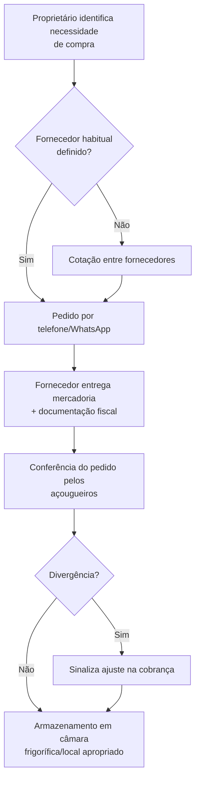
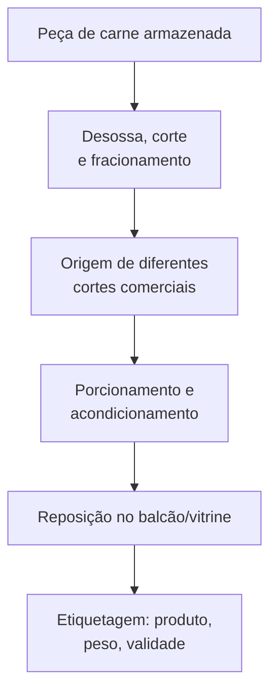
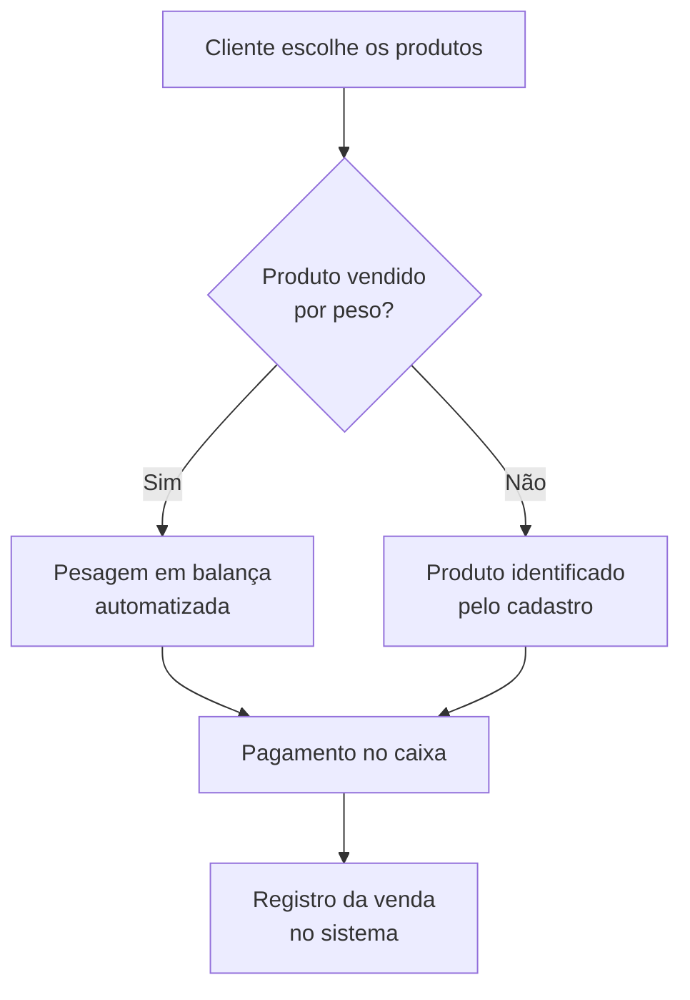
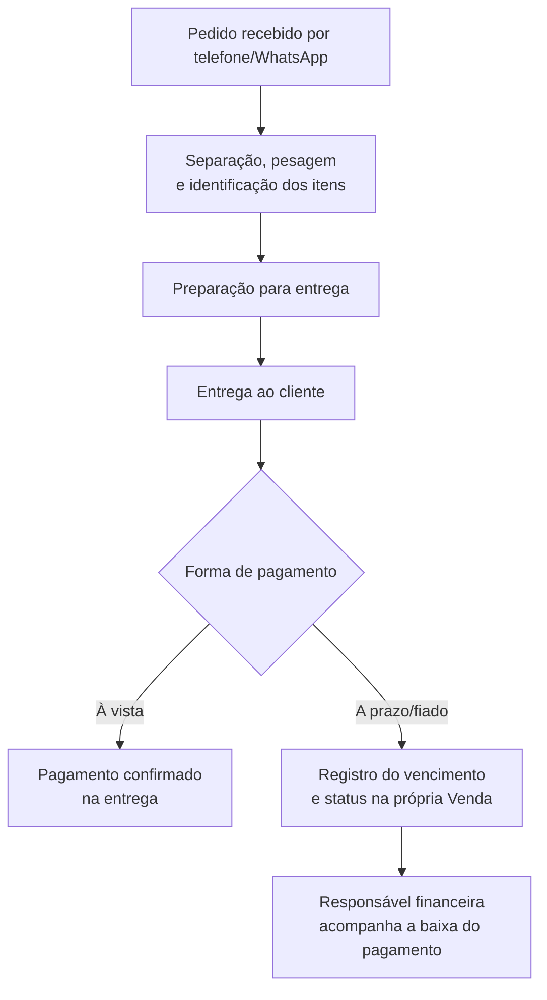
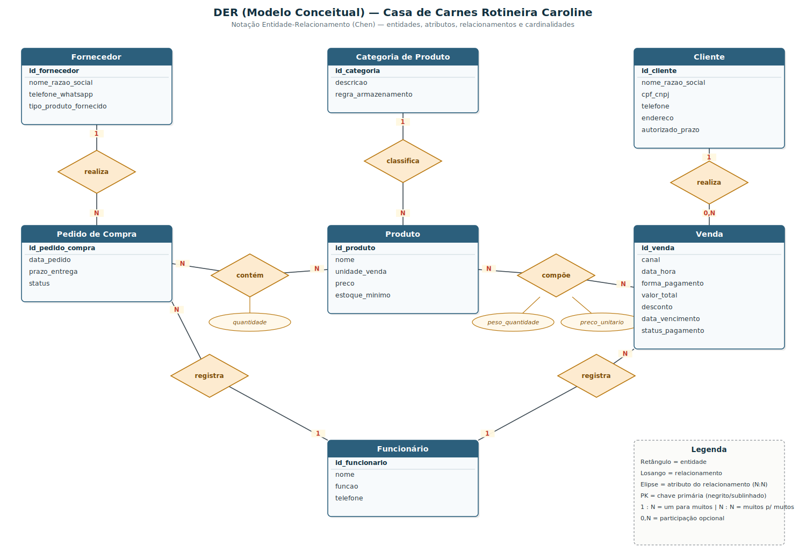

# Entrega 1 — Modelo Conceitual (DER)
### Modelagem de um sistema de gestão de informações para uma organização de pequeno porte

**Grupo:**
- Gabriel Diniz Tavares da Costa — RGM 48222721
- Isaac Santos Alves da Costa — RGM 48222852
- Rafael Aceiro Ferreira Gomes — RGM 1748225223
- Paulo Henrique Fernandez Prado — RGM 48100650

**Organização:** Casa de Carnes Rotineira Caroline

> O DER está anexado a este repositório em formato de imagem: [`DER_acougue_preview.png`](./DER_acougue_preview.png) (ver Seção 7).
> O Dicionário de Dados Conceitual está anexado a este repositório em HTML: [`dicionario_dados.html`](./dicionario_dados.html) (ver Seção 5).

---

## 1. Caracterização da Organização

- **Nome e natureza da organização:** Casa de Carnes Rotineira Caroline, comércio varejista de carnes, produtos congelados e mercearia, com fins lucrativos, único estabelecimento (sem filiais).
- **Contexto e porte:** Estabelecimento em funcionamento há mais de 15 anos, formalizado e com CNPJ ativo. A operação conta com 12 pessoas: 1 proprietário, 5 açougueiros, 2 balconistas, 2 operadores de caixa, 1 ajudante geral, 1 entregador e 1 responsável administrativo-financeiro. Funciona de segunda a sábado das 7h30 às 20h, e aos domingos e feriados das 7h30 às 14h, com um volume médio de 300 a 400 vendas por dia — o que caracteriza uma operação de médio porte para os padrões do setor.
- **Problemas e necessidades identificados:** O estabelecimento já utiliza um sistema de gestão para cadastro de produtos, preços e registro de vendas no caixa, mas diversos controles importantes ainda são feitos de forma manual/visual e ficam fora do sistema:
  - Não há cadastro de fornecedores no sistema (contatos ficam na agenda pessoal do proprietário), embora a função exista.
  - Não há controle de estoque automatizado: entradas de mercadorias não geram movimentação de estoque, e o saldo de cada produto só é conhecido por contagem física.
  - Não existe estoque mínimo parametrizado — a reposição depende da experiência dos responsáveis.
  - As perdas de peso decorrentes de desossa e corte (ossos, gordura, aparas) não são quantificadas no sistema.
  - As vendas a prazo/fiado são controladas por planilha e vias de pedido assinadas, fora do sistema, gerando trabalho manual de conciliação pela responsável financeira.
  - Não há rastreabilidade centralizada de lote/validade — as informações ficam dispersas em etiquetas e embalagens.
- **Justificativa da escolha:** O açougue é uma organização real, de porte adequado ao trabalho (nem tão simples a ponto de faltar processos, nem grande/complexa a ponto de ser inviável nesta etapa), com processos de negócio ricos e específicos do setor (compra e desossa de carne, controle de validade, venda por peso, venda a prazo/fiado, delivery) que geram entidades e regras de negócio suficientes para uma modelagem conceitual completa. Além disso, o grupo teve acesso direto ao proprietário para o levantamento de requisitos em campo.
- **Evidências da organização:**
  - Google Maps: https://share.google/IGnQx2U8OIvA5kZfN
  - WhatsApp: (11) 96283-0823
  - Estabelecimento formalizado, com CNPJ ativo

---

## 2. Processos de Negócio

### 2.1 Principais processos mapeados

1. **Compra e recebimento de mercadorias junto a fornecedores** (inclui cotação, pedido, recebimento e conferência fiscal).
2. **Preparação e disponibilização das carnes para venda** (desossa, corte, porcionamento, embalagem, etiquetagem).
3. **Controle de estoque e validade** (verificação física periódica, identificação de necessidade de reposição).
4. **Venda no balcão** (pesagem, identificação, pagamento).
5. **Venda por telefone/WhatsApp e delivery/encomenda**.
6. **Venda a prazo (boleto ou "fiado")** e controle dos valores devidos por cliente.
7. **Descarte de resíduos** da manipulação das carnes.

### 2.2 Fluxogramas

**Processo de compra e recebimento**

**Preparação da carne e disposição para venda**

**Venda no balcão**

**Venda por delivery/encomenda e venda a prazo**

---

## 3. Requisitos do Sistema

### 3.1 Requisitos Funcionais

- O sistema deve permitir cadastrar produtos com nome, tipo/categoria e preço.
- O sistema deve permitir registrar vendas por peso (integração com balança) e por unidade.
- O sistema deve permitir registrar vendas realizadas no balcão, por telefone/WhatsApp e delivery.
- O sistema deve permitir emitir etiquetas com identificação do produto, peso e validade.
- O sistema deve permitir registrar encomendas/pedidos futuros quando o produto não está disponível.
- O sistema deve permitir cadastrar fornecedores e associá-los aos pedidos de compra realizados.
- O sistema deve permitir registrar pedidos de compra a fornecedores (produtos, quantidades, prazo de entrega, valor).
- O sistema deve permitir registrar a movimentação de entrada de mercadorias e atualizar o saldo de estoque.
- O sistema deve permitir consultar o saldo de estoque atual de cada produto.
- O sistema deve permitir definir um estoque mínimo por produto e alertar quando o saldo estiver abaixo dele.
- O sistema deve permitir registrar o controle de validade dos produtos armazenados.
- O sistema deve permitir registrar clientes (nome/razão social, CPF/CNPJ, telefone, endereço) quando necessário para emissão fiscal, boleto ou venda a prazo.
- O sistema deve permitir registrar em cada venda a forma de pagamento, incluindo a opção **fiado**, com data de vencimento e status de pagamento quando aplicável.
- O sistema deve permitir controlar a baixa (pagamento) das vendas feitas a prazo ou fiado por cliente.
- O sistema deve permitir registrar diferentes formas de pagamento (dinheiro, Pix, cartão de crédito/débito, vale-alimentação/refeição, boleto, fiado).
- O sistema deve permitir registrar funcionários e a função exercida por cada um.
- O sistema deve permitir registrar descontos concedidos, associados à autorização do proprietário.

### 3.2 Requisitos Não Funcionais

- **Usabilidade:** o sistema deve ser simples o suficiente para uso por balconistas e operadores de caixa durante o atendimento, sem atrasar a fila.
- **Desempenho:** o registro de uma venda (incluindo pesagem) deve ser processado em poucos segundos, dado o alto volume diário (300–400 vendas/dia).
- **Confiabilidade:** o sistema deve manter a integridade dos dados de estoque e financeiro mesmo diante de falhas, evitando divergências entre estoque físico e sistêmico.
- **Segurança:** o acesso a informações financeiras e a dados de clientes (CPF/CNPJ, endereço) deve ser restrito a perfis autorizados (proprietário e responsável administrativo-financeira).
- **Disponibilidade:** o sistema deve estar disponível durante todo o horário de funcionamento do estabelecimento (7h30–20h em dias úteis e sábados; 7h30–14h aos domingos/feriados).
- **Escalabilidade:** o modelo de dados deve comportar a inclusão futura de controle automatizado de estoque e rastreabilidade de lote, hoje realizados manualmente.

---

## 4. Regras de Negócio

### Regras operacionais

- Uma venda por peso só pode ser registrada após a pesagem do produto na balança automatizada.
- Uma venda com forma de pagamento fiado ou boleto só pode ser realizada para clientes previamente autorizados pelo proprietário.
- Descontos só podem ser concedidos mediante autorização do proprietário; não há regra automática de desconto.
- Uma encomenda pode ser registrada mesmo quando o produto não está disponível no estoque no momento da solicitação.
- O prazo de pagamento de vendas via boleto é de 15 dias; vendas fiado autorizadas têm prazo de até 30 dias.
- A cada venda a prazo/fiado são emitidas 3 vias do pedido, assinadas pelo cliente no momento da entrega ou retirada.
- Peças de carne recebidas em maior porte devem passar por desossa/corte antes de serem disponibilizadas como cortes comerciais para venda.
- Resíduos da manipulação de carnes (ossos, gordura, pele) devem ser separados e acondicionados para coleta diária por empresa especializada.
- A identificação do cliente por CPF só é exigida quando necessária para emissão de documento fiscal, boleto ou faturamento.

### Restrições organizacionais

- **Sanitárias/legais:** produtos perecíveis exigem controle de validade e condições específicas de armazenamento/conservação por categoria (carnes, congelados, mercearia, bebidas), refletindo normas sanitárias aplicáveis ao comércio de alimentos.
- **Fiscais:** vendas exigem emissão de cupom/documento fiscal; vendas com faturamento/boleto exigem dados cadastrais completos do cliente (nome/razão social, CNPJ, telefone, endereço).
- **Operacionais:** a divisão de funções é rígida quanto a atividades de desossa e corte — apenas açougueiros realizam essas tarefas, os balconistas não.
- **Financeiras:** o controle das vendas a prazo é hoje mantido fora do sistema principal (planilha), o que o modelo de dados deve endereçar como oportunidade de melhoria.

---

## 5. Dicionário de Dados Conceitual (Preliminar)

> **O dicionário de dados completo está anexado a este repositório em HTML:** [`dicionario_dados.html`](./dicionario_dados.html)

O dicionário cobre as 7 entidades do modelo (Fornecedor, Categoria de Produto, Produto, Pedido de Compra, Cliente, Venda, Funcionário) e os atributos que hoje pertencem aos **relacionamentos N:N** do DER — *quantidade* (relacionamento Pedido de Compra × Produto) e *peso_quantidade* / *preco_unitario* (relacionamento Produto × Venda) — conforme a Seção 7.

**Atenção à privacidade:** todos os valores de exemplo usados são fictícios, apenas coerentes com a operação observada — não são dados reais de clientes, fornecedores ou funcionários do estabelecimento.

---

## 6. Modelagem Conceitual (Entidades, Atributos, Relacionamentos)

- **Entidades reconhecidas:** Fornecedor, Categoria de Produto, Produto, Pedido de Compra, Cliente, Venda, Funcionário. Cada uma corresponde a um conceito distinto identificado na entrevista de campo (cadeia de suprimentos, catálogo de produtos, operação de compra, operação de venda, crédito ao cliente e equipe).
- **Atributos e classificações:** detalhados no dicionário de dados anexado ([`dicionario_dados.html`](./dicionario_dados.html)).
- **Relacionamentos pertinentes** (representados como losangos no DER, com cardinalidades em cada ponta):
  - **Fornecedor — realiza — Pedido de Compra** (1:N): um fornecedor realiza vários pedidos de compra; cada pedido pertence a um único fornecedor.
  - **Funcionário — registra — Pedido de Compra** (1:N): um funcionário registra vários pedidos de compra.
  - **Pedido de Compra — contém — Produto** (N:N): um pedido de compra pode conter vários produtos, e um produto pode constar em vários pedidos de compra. O relacionamento carrega o atributo *quantidade*.
  - **Categoria de Produto — classifica — Produto** (1:N): uma categoria classifica vários produtos.
  - **Produto — compõe — Venda** (N:N): uma venda pode ser composta por vários produtos, e um produto pode estar presente em várias vendas. O relacionamento carrega os atributos *peso_quantidade* e *preco_unitario*.
  - **Cliente — realiza — Venda** (1:0,N): um cliente pode realizar várias vendas, mas uma venda de balcão pode não ter cliente identificado (participação opcional do lado da Venda).
  - **Funcionário — registra — Venda** (1:N): um funcionário registra várias vendas.
- **Sobre a venda a prazo/fiado:** não constitui mais uma entidade própria. Os dados de venda a prazo (*forma_pagamento* podendo ser "fiado", *data_vencimento*, *status_pagamento*) foram incorporados diretamente à entidade **Venda**, evitando uma entidade auxiliar para um caso que é, na prática, um atributo/variação da própria venda.
- **Restrições e políticas organizacionais aplicadas ao modelo:** a obrigatoriedade de cliente autorizado para vendas fiado/boleto, a exigência de pesagem para itens vendidos por peso, e a diferenciação de regras de armazenamento por categoria de produto foram incorporadas como restrições no modelo.

---

## 7. Diagrama Entidade-Relacionamento (DER)

O DER completo (entidades, atributos, relacionamentos representados como losangos, atributos de relacionamento e cardinalidades) está anexado a este repositório em formato de imagem vetorial: [`
DER_acougue_preview.png`](./DER_acougue_preview.png).

O diagrama segue a notação clássica de Entidade-Relacionamento (Chen): retângulos para entidades, losangos para relacionamentos e elipses para os atributos que pertencem a um relacionamento (nos dois casos N:N do modelo).

---

## 8. Justificativa Técnica

**Item do Pedido de Compra e Item de Venda como atributos de relacionamento, não como entidades.** Em uma primeira versão do modelo, cada produto dentro de um pedido de compra ou de uma venda foi tratado como uma entidade associativa própria (Item de Pedido de Compra, Item de Venda). Essa representação é típica de um modelo já orientado ao esquema relacional (pensando em tabelas de junção com chave primária própria), mas foge do nível de abstração adequado a um DER conceitual. Na notação de Chen, quando um relacionamento N:N carrega informações que só existem naquela combinação específica (a quantidade de um produto em um pedido, o peso e o preço unitário de um produto em uma venda), o caminho mais direto é atribuir esses dados ao próprio losango do relacionamento, e não criar uma entidade adicional para representá-los. Foi por isso que os atributos *quantidade* (em Pedido de Compra × Produto) e *peso_quantidade* / *preco_unitario* (em Produto × Venda) passaram a ser atributos de relacionamento: eles descrevem a associação entre as duas entidades, não um conceito autônomo do domínio do açougue.

**Venda a Prazo incorporada à entidade Venda.** Inicialmente, a venda a prazo/fiado foi modelada como uma entidade separada, na tentativa de isolar o controle de vencimento e pagamento observado hoje na planilha da responsável financeira. Entretanto, do ponto de vista conceitual, "venda a prazo" não é um conceito distinto de "venda" — é uma variação da mesma venda, diferenciada apenas pela forma de pagamento escolhida. Criar uma entidade separada geraria uma redundância desnecessária (duplicando atributos como data, cliente, funcionário responsável e valor) e um relacionamento 1:1 artificial entre Venda e Venda a Prazo. Por isso, os atributos *data_vencimento* e *status_pagamento* foram movidos para dentro da própria entidade Venda, com a ressalva de que eles só fazem sentido quando o atributo *forma_pagamento* é igual a "boleto" ou "fiado" — nas demais formas de pagamento (dinheiro, Pix, cartão, vale-alimentação), esses dois campos permanecem nulos. Essa é uma restrição de dependência funcional condicional que deve ser tratada na etapa de modelagem lógica (por exemplo, via constraint ou validação de aplicação), mas que já fica registrada aqui como regra de negócio do modelo conceitual.

**Cliente como participação opcional (0,N) na Venda.** O levantamento em campo mostrou que a maior parte das vendas de balcão — que representam o volume mais expressivo dentro das 300 a 400 vendas diárias — não identifica o cliente: o comprador escolhe o produto, ele é pesado, e o pagamento é feito sem qualquer cadastro associado. A identificação do cliente só se torna necessária em situações específicas: emissão de documento fiscal com dados completos, venda por boleto ou venda fiado autorizada pelo proprietário. Modelar Cliente como participação obrigatória na Venda (1,N obrigatório dos dois lados) forçaria o cadastro de um cliente fictício ou genérico para toda venda de balcão sem identificação, o que não reflete a operação real e polui o modelo de dados. Por isso, a cardinalidade mínima do lado da Venda em relação a Cliente é 0, refletindo fielmente que a venda existe independentemente de haver um cliente identificado.

**Funcionário relacionado tanto a Pedido de Compra quanto a Venda.** A operação do açougue envolve dois fluxos distintos em que a responsabilidade de um funcionário precisa ficar registrada: o registro do pedido de compra junto ao fornecedor (tipicamente feito pelo proprietário ou pela responsável administrativo-financeira) e o registro da venda no caixa (feito pelos operadores de caixa ou balconistas). Caso Funcionário se relacionasse apenas com um dos dois processos, o modelo perderia rastreabilidade sobre quem realizou a outra operação — o que é relevante tanto para fins de controle interno (ex.: apurar divergências de estoque ou de caixa) quanto para eventual auditoria financeira, já que o próprio levantamento identificou a ausência de rastreabilidade centralizada como um dos problemas do estabelecimento. Por isso, Funcionário mantém dois relacionamentos 1:N independentes: um com Pedido de Compra (*registra*) e outro com Venda (*registra*), permitindo que cada operação — de compra ou de venda — aponte para o funcionário responsável por seu registro.

---

## 9. Uso de Inteligência Artificial

| Item | Registro |
|------|------------------|
| **Ferramenta e etapa** | Claude (Anthropic) foi usado em duas etapas: (1) organização das respostas do levantamento de campo na estrutura do README e elaboração de um primeiro DER; (2) revisão do modelo conceitual e do DER a partir de correções indicadas pelo professor — remoção das entidades Venda a Prazo, Item de Pedido de Compra e Item de Venda; inclusão de losangos de relacionamento e do atributo de forma de pagamento "fiado"; separação do dicionário de dados para um arquivo HTML anexado ao repositório. |
| **Motivação** | O grupo já havia realizado a entrevista de campo e recebido uma primeira correção do professor, e precisava adequar o README, o DER e o dicionário de dados às orientações recebidas. |
| **Prompt(s) utilizados** | "Quero que você faça o read.me do nosso projeto com base nas informações que já te foram passadas e no esqueleto da entrega 1"; "faça o DER completo do estabelecimento com as entidades que você fez"; e, nesta rodada, o envio do README já preenchido pelo grupo junto com a lista de correções do professor (remover 3 entidades, adicionar losangos, adicionar atributo de pagamento fiado, mover DER e dicionário de dados para arquivos anexados). |
| **Resposta recebida** | Um README revisado, um novo DER em SVG com notação de losangos (Chen) e atributos de relacionamento, e um dicionário de dados em HTML separado do README, todos refletindo as correções solicitadas pelo professor. |
| **Fontes consultadas e verificadas** | Nenhuma fonte externa foi usada — o conteúdo foi derivado exclusivamente das respostas da entrevista de campo e das correções indicadas pelo professor. |
| **Justificativa da escolha final** | O grupo manteve e adaptou as sugestões da IA conforme as informações da entrevista e as correções do professor. Foram mantidas melhorias na organização do README, no dicionário de dados e no DER, enquanto alterações não fundamentadas nas orientações do professor ou nos dados coletados foram rejeitadas. Assim, a IA foi utilizada como ferramenta de apoio, mas a decisão final e a validação das informações ficaram sob responsabilidade do grupo. |
| **Reflexão crítica** | A IA não participou da correção feita pelo professor nem da visita ao estabelecimento; as mudanças de modelagem (remoção de entidades, atributos de relacionamento) foram aplicadas com base apenas nas instruções recebidas do grupo, repassando a orientação do professor. O grupo deve validar se a forma como os atributos de relacionamento (quantidade, peso_quantidade, preco_unitario) foram representados no DER está de acordo com o que foi pedido em sala. |

---

## Resumo dos Pesos

| Dimensão | Peso total |
|----------|-----------|
| Conceitual (contexto, requisitos/regras, modelagem, justificativa técnica) | 30% |
| Procedimental (requisitos, fluxogramas, dicionário de dados, DER) | 50% |
| Atitudinal (participação, comprometimento, colaboração, autonomia) | 20% |

**Entrega final:** README.md completo + DER anexado (`DER_acougue_preview.png`) + Dicionário de Dados anexado (`dicionario_dados.html`) no repositório GitHub do grupo.
